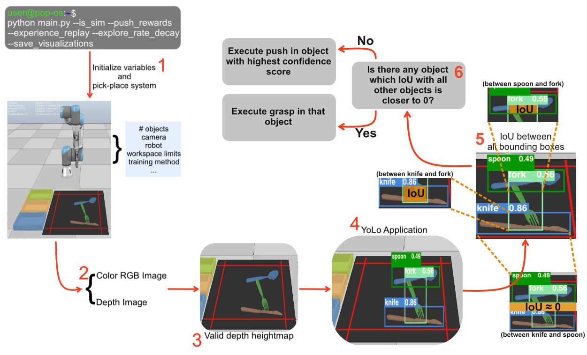

# Cutlery Visual Pushing-for-Grasping

Collaborative robots, or commonly described as <b>Cobots</b>, play an important role in our professional lives nowadays, helping humans perform tasks that normally would take a lot of time when done by a person.

These robots saw a rapid growth in their usage since the last 5 years and the perspective shows that the <a href="https://www.roboticsbusinessreview.com/manufacturing/cobot-market-outlook-strong/">number of Cobots Sold</a> until 2027 will hit an astounding number of 7500 aprox.
 
However, there are some tasks that are sensible and difficult for a robot to perform without failing. Amongst them, we focused our work on grasping one particular type of objects. The <b>cutlery</b> objects, such as spoons, knives and forks.
  

These kind of objects is particularly difficult to manage and execute actions on, mainly due to their thin structure and material, that sometimes can make them hard to identify and therefore, also hard to grasp.

This work features two different data sets. First, we ran our work with 3D cutlery object models retrieved from <a href="http://ycb-benchmarks.s3-website-us-east-1.amazonaws.com/">YCB dataset</a> and lastly, we ran second experiment with 3D cutlery object models retrieved from <a href="https://www.turbosquid.com/">TurboSquid</a>.

 
In this work, you'll be able to see two variants of the work developed, which we called <b>Oursv1</b> and <b>Oursv2</b>. They were only tested in simulation and are based on the pushing and grasping algorithm <a href="https://github.com/andyzeng/visual-pushing-grasping">Visual Pushing-for-Grasping</a>, which is already prepared to work in simulation and reality with an Universal Robot (UR3) and the object detection model <a href="https://github.com/ultralytics/yolov5">Yolov5</a>. The only difference between these versions, is the way we preprocess the image taken during simulation with the object detection model to obtain the coordinates of the object we want to grasp or push.
 
 

The schematic above represents <b>Oursv1</b> version.
 
 
As you might see, we apply the object detection model on to an image taken from the current state of the simulation, to obtain the label of the object with highest confidence score attributed by <a href="https://github.com/ultralytics/yolov5">Yolov5</a>. With this label, we crop the depth image and generate a point cloud that represents the object we want to grasp. Afterwards, we use the <u>mean k neighbors</u> algorithm in 20% of the point cloud's points to get centered coordinates that represent the object in simulation and tell the robot to grasp in that location and, if successful to place the object in the desired container according to the detection previously made.
 
 

The schematic above represents <b>Oursv2</b> version.
 
 
In the schematic above, we apply the object detection model on to an image taken from the current state of the simulation, however we compute the overlap area of each pair of bounding boxes. If, there is an object whose overlapping areas with other objects are closer to 0, we will tell the robot to execute a grasp on it and to place it in the correct container. Otherwise, we pick the object with highest confidence score attributed by the object detection model to be the one to be pushed by the robot.

 
To evaluate both our versions we designed new evaluation metrics.
 
We evaluate the whole simulation in terms of push and grasp ratio, as well as its accuracy. The first two metrics are related to push and grasp ratios.

 
As results have shown us, the second version outperforms the first, obtaining 32.14% of successful grasp ratio. But, we can say that there is margin for improvement.
